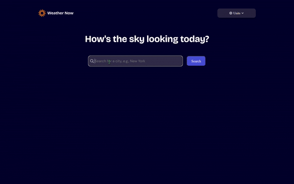
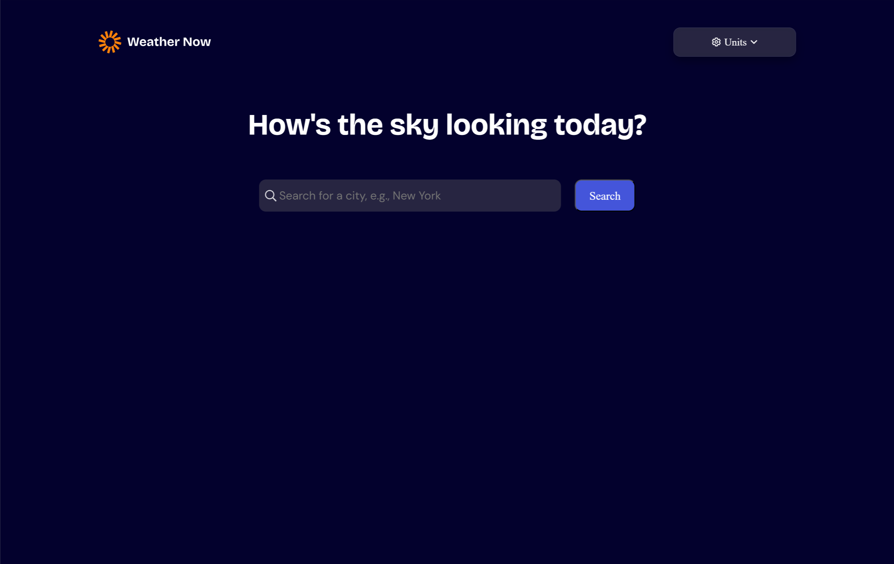
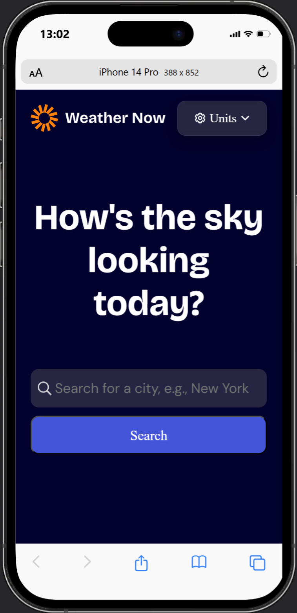
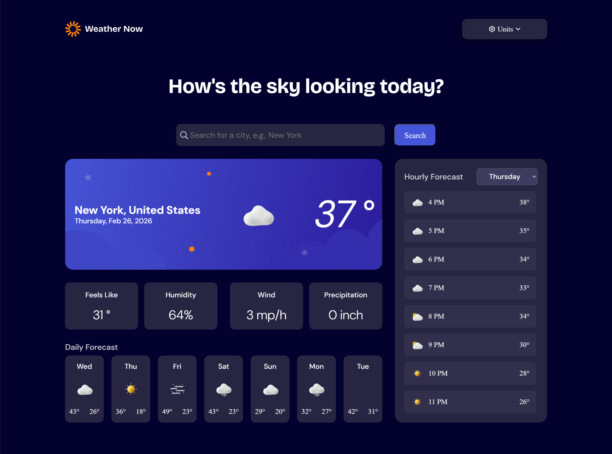
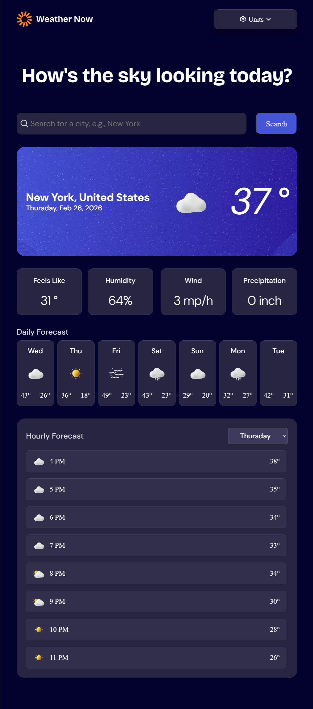
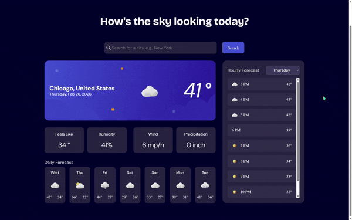

<div align="center">
  
</div>

# Weather App (React + Open-Meteo API)

Production-style weather application built with React 19 and Vite. Users can search any location and view current conditions, hourly trends, and 7-day forecasts with unit switching and responsive layouts.

Live challenge brief: [Frontend Mentor - Weather App](https://www.frontendmentor.io/challenges/weather-app-K1FhddVm49)

## Why This Project

I built this project to strengthen practical frontend skills in:

- API-driven UI architecture
- State modeling for multi-view weather data (current, hourly, daily)
- Responsive, accessible component design
- Refactoring for readability and maintainability

### Source

This project was developed from one of the [Frontend Mentor Challenge Projects](https://www.frontendmentor.io/challenges/weather-app-K1FhddVm49).

[Frontend Mentor](https://www.frontendmentor.io) has been an invaluable resource for me; especially for their professional format Challenge Projects in which you are given the finished product requirements, a Figma design file, and the decision making process is up to you.

## Key Features

- Location-based weather search
- Current weather conditions:
  - Temperature
  - Weather icon
  - Location metadata
- Additional metrics:
  - Feels like
  - Humidity
  - Wind speed
  - Precipitation
- 7-day forecast with daily high/low values
- Hourly forecast with selectable day view
- Unit switching:
  - Celsius / Fahrenheit
  - km/h / mph
  - millimeters
- Responsive layouts across desktop, tablet, and mobile
- Hover and focus states for interactive controls

## Tech Stack

- [React v19.1.1](https://react.dev)
- [Vite v7.1.7](https://vite.dev)
- [@vitejs/plugin-react-swc](https://github.com/vitejs/vite-plugin-react/tree/main/packages/plugin-react)
- [Open-Meteo API](https://open-meteo.com/)

Node requirement: Vite 7 requires Node.js `20.19+` or `22.12+`.

## Getting Started

```bash
git clone https://github.com/notavailable4u/weather-app
cd weather-app
npm install
npm run dev
```

Open the local URL shown in the terminal (typically `http://localhost:5173`).

## Scripts

- `npm run dev` - start development server
- `npm run build` - build production bundle
- `npm run preview` - preview production build locally
- `npm run lint` - run ESLint

## Engineering Notes

- Implemented a two-step location flow (geocoding -> forecast query) for city-name search.
- Refactored component logic to improve separation of concerns and readability.
- Reworked conditional icon mapping for cleaner rendering logic.
- Prioritized reusable component patterns for forecast and metric display.

## Validation

- Manual validation completed for core flows (search, units toggle, day selection, responsive behavior).
- Automated tests are planned as the next project stage.

## Planned Improvements

- Add automated tests (Vitest/Jest + React Testing Library)
- Migrate to TypeScript
- Expand error/empty states and UX polish

## AI Usage Disclosure

AI tools (GitHub Copilot, Codex, ChatGPT) were used for code review, refactoring guidance, and implementation support. Final architectural and code decisions were made by me.

## Screenshots

**Home - Desktop**



**Home - Tablet**


**Home - Mobile (iPhone 14 Pro mockup)**



**Results - Desktop**



**Results - Tablet**



**Search + Results Flow (GIF)**


**Hourly Day Selection (GIF)**


